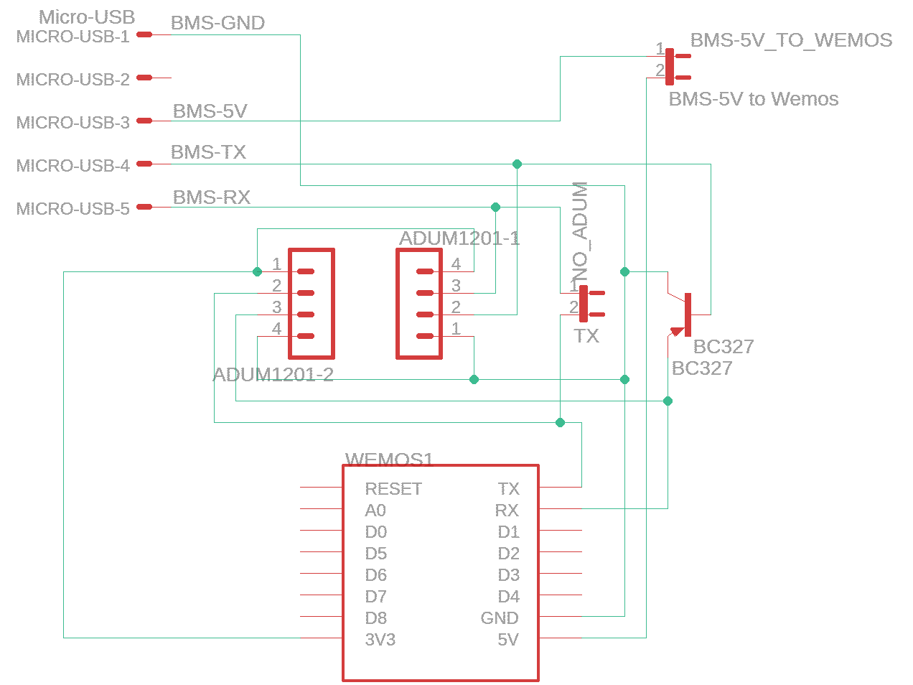
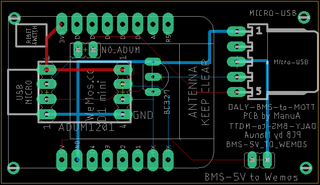
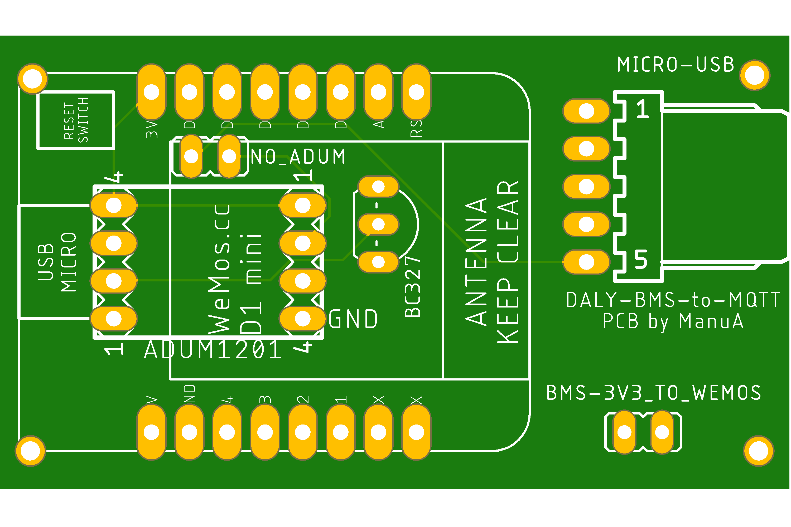
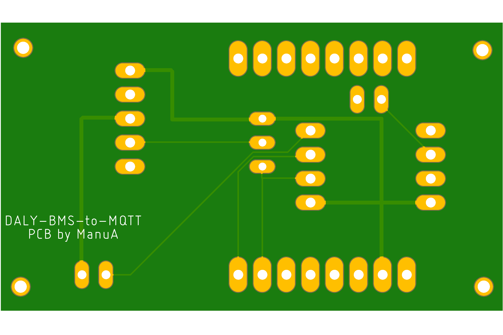

<h2>PCB for Wemos and BC327 OR ADUM1201</h2>

PCB for the Wemos with <b>either</b> the BC327 transistor or optionally the ADUM1201.

I have deliberately not used SMDs, so that anyone can build it.

When using the BC327, the jumper "NO_ADUM" must be set.

As an additional option, the jumper "BMS-5V_TO_WEMOS" can be plugged in. With this, the Wemos is then completely supplied with power by the BMS. This depends on the type of BMS used (tested with an 8S 100A, HW version BMS-ST103-309E).  
Please note: as soon as the BMS switches off, the Wemos no longer receives power and is offline. 
<b>Never connect the Wemos via its own USB when the jumper is plugged in!</b> 

 

 

 

 

A good supplier for PCBs is, for example, JLCPCB ( https://jlcpbc.com ). Simply upload the Gerber ZIP available here, and you're done. I paid just under €10 for 10 PCBs (including shipping, customs and fees).

<b>Required components:</b>
- Wemos D1 Mini
- BC327 or ADUM1201
- 2x jumper
- Micro-USB breakout board

